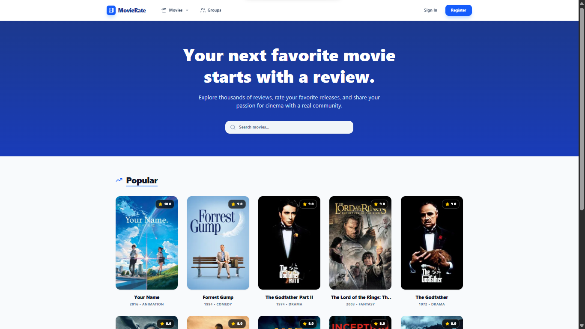

# Reviews Website - Frontend Client

## Live Demo & Backend
* **Live Application:** [View Live Demo](https://reviews-website-five.vercel.app/)
* **Backend API Repository:** [Reviews Website Backend](https://github.com/MatiRaimondi1/Reviews-Website-Server)

---

## Features

* Group System: Join communities, participate in discussions, and view the specific activity of each group.
* Meeting Management: Group leaders can schedule, view, and delete meetings with direct links (Google Meet, Zoom, etc.).
* Interactive Reviews: Publish, edit, and delete your movie reviews with a 1-to-10 rating system.
* Secure Authentication: Next.js middleware for route protection and session management using JWT.

---

## Tech Stack

This project is built using the following technologies:

* **Framework: Next.js 16.1.6**
* **Styling: Tailwind CSS 4 (via @tailwindcss/postcss)**
* **Icons: Lucide React 0.577.0**
* **Notifications: Sonner 2.0.7**
* **Animations: Tailwind Animate & Transitions**

---

## Screenshot



---

## Installation

Clone the repository:

```bash
git clone https://github.com/MatiRaimondi1/Reviews-Website-Client-Remake.git
cd Reviews-Website-Client-Remake
```

Install dependencies:

```bash
pnpm install
```

---

## Environment Variables

Create a `.env` file in the root directory and configure the following variables:

```env
NEXT_PUBLIC_API_URL=your_api_url
```

---

## Development

Start the development server:

```bash
npm run dev
```

The app will be available at:

```
http://localhost:3000
```

---

## Production Build

```bash
npm run build
npm start
```

---

## Project Structure

```
/app            → Application routes (Next.js App Router)
/components     → Reusable UI components
/context        → Authentication Context
/public         → Static assets
```

---
